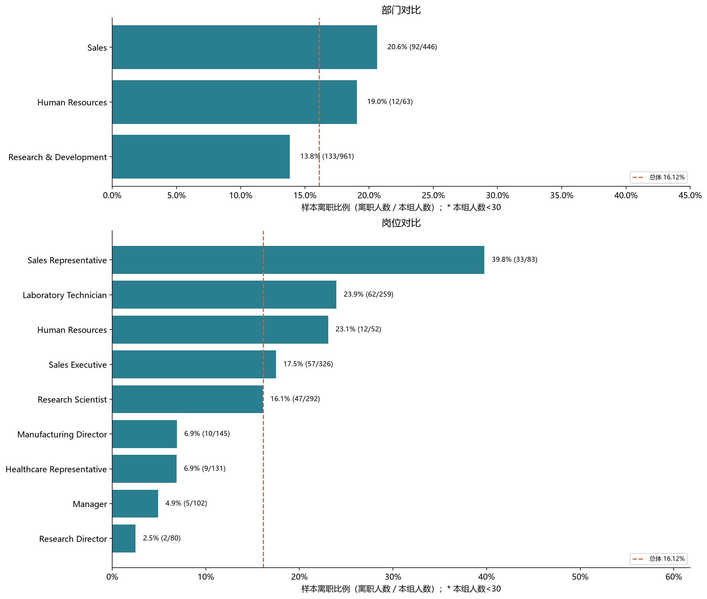
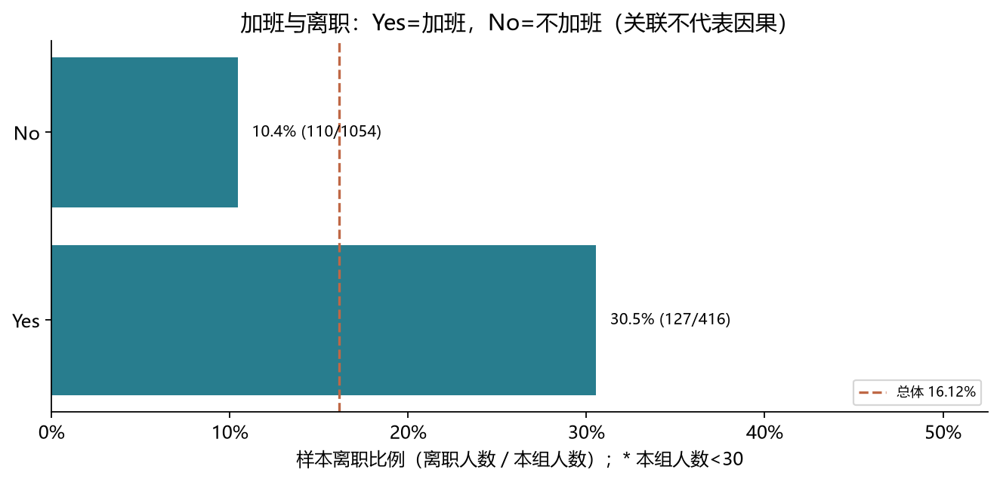
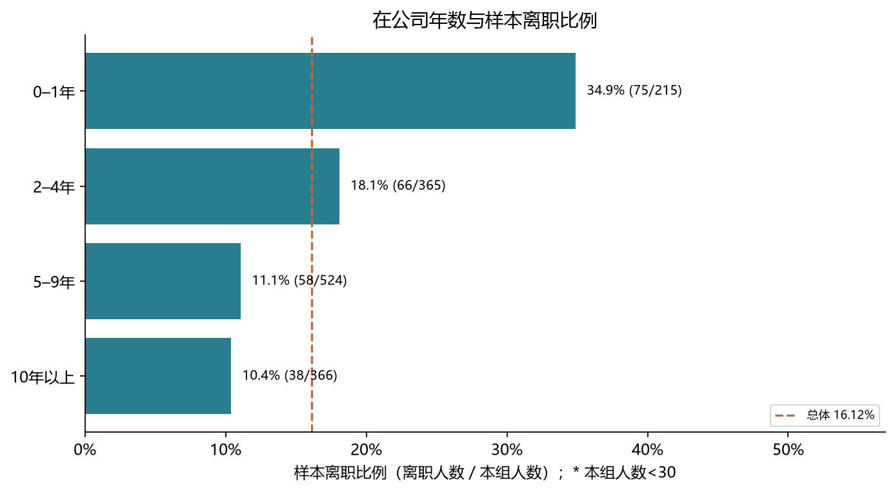
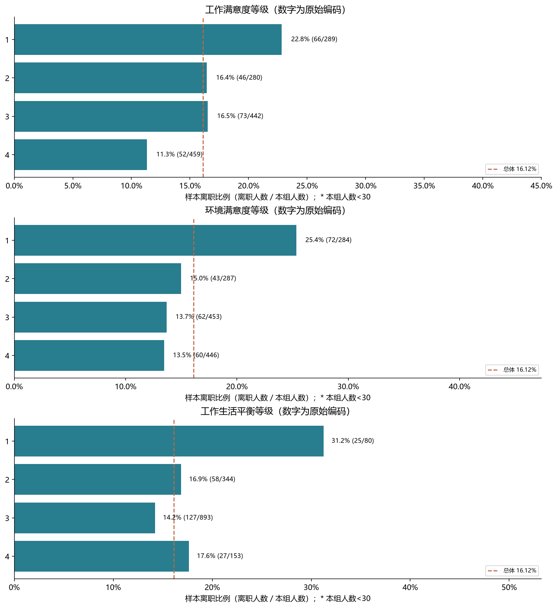
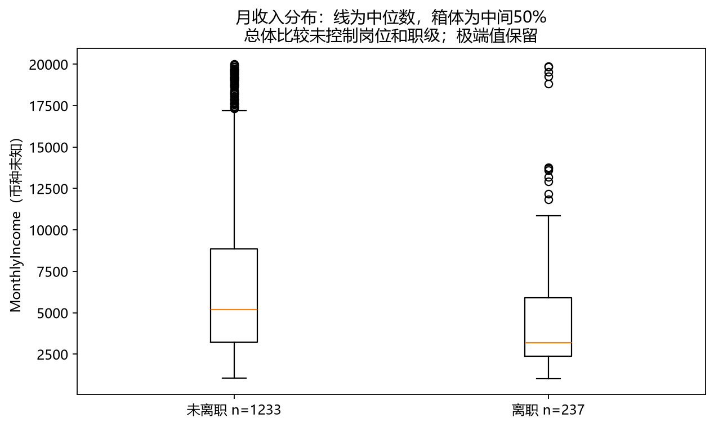

# 探索性分析报告（阶段3–4）

公开模拟HR数据；无日期；所有比例是样本离职比例，不是年度离职率。没有进行统计显著性检验、置信区间估计或模型训练。

## 怎么理解这些数字

每组离职比例=该组离职人数÷该组人数。人数和比例必须一起看；小于30人的组仅提示不稳定，不是统计学上的绝对阈值。图中虚线为总体16.12%。

## 五条主要发现

1. 加班组离职127 / 416人（30.53%），不加班组110 / 1054人（10.44%），相差20.09个百分点。需要进一步排查岗位构成，不能解释为加班的因果效果。
2. 岗位中Sales Representative的观察比例最高：33/83（39.76%）。排序只是当前样本描述，不等于稳定风险排名。
3. 在公司0–1年组离职75/215（34.88%）。值得调查新人融入过程；快照比较也受到留存选择影响，不能估计员工随时间变化的离职概率。
4. 工作满意度编码1组为66/289（22.84%），编码4组为52/459（11.33%）。评分测量时间未知，不能断定满意度变化先于离职。
5. 离职组月收入中位数3,202（n=237），未离职组5,204（n=1233）。这是总体构成差异，不能直接认定加薪可以留人。已另存同岗位同职级的比较表，小组人数不足时不下结论。

## 部门

|分组|人数|离职人数|离职比例|提示|
|---|---:|---:|---:|---|
|Human Resources|63|12|19.05%||
|Research & Development|961|133|13.84%||
|Sales|446|92|20.63%||

## 岗位

|分组|人数|离职人数|离职比例|提示|
|---|---:|---:|---:|---|
|Healthcare Representative|131|9|6.87%||
|Human Resources|52|12|23.08%||
|Laboratory Technician|259|62|23.94%||
|Manager|102|5|4.90%||
|Manufacturing Director|145|10|6.90%||
|Research Director|80|2|2.50%||
|Research Scientist|292|47|16.10%||
|Sales Executive|326|57|17.48%||
|Sales Representative|83|33|39.76%||

## 加班

|分组|人数|离职人数|离职比例|提示|
|---|---:|---:|---:|---|
|No|1054|110|10.44%||
|Yes|416|127|30.53%||

## 在公司年数

|分组|人数|离职人数|离职比例|提示|
|---|---:|---:|---:|---|
|0–1年|215|75|34.88%||
|2–4年|365|66|18.08%||
|5–9年|524|58|11.07%||
|10年以上|366|38|10.38%||

## 工作满意度

|分组|人数|离职人数|离职比例|提示|
|---|---:|---:|---:|---|
|1|289|66|22.84%||
|2|280|46|16.43%||
|3|442|73|16.52%||
|4|459|52|11.33%||

## 环境满意度

|分组|人数|离职人数|离职比例|提示|
|---|---:|---:|---:|---|
|1|284|72|25.35%||
|2|287|43|14.98%||
|3|453|62|13.69%||
|4|446|60|13.45%||

## 工作生活平衡

|分组|人数|离职人数|离职比例|提示|
|---|---:|---:|---:|---|
|1|80|25|31.25%||
|2|344|58|16.86%||
|3|893|127|14.22%||
|4|153|27|17.65%||

## 收入分析为什么要分层

不同岗位和职级本来就可能收入不同。`tables/income_by_role_level_status.csv`按岗位、职级和离职标签给出人数、中位数、均值；`relative_income_strata.csv`在每个岗位×职级内按收入是否低于本组中位数分组。并列中位数归入“中位数及以上”，不存在的组合不补零。没有把这些细组简单平均，也没有把分层描述说成已控制全部混杂因素。

## 其他探索表

培训次数、晋升间隔、职级表已保存在tables目录。岗位×加班、职级×加班表供下一阶段分层统计使用；本轮不凭大量探索比较挑选“显著”结论。

## 可以进一步验证的业务方向

- 调查加班较多岗位的工作负荷与排班；先验证岗位差异，再考虑措施。
- 访谈入职0–1年的员工，检查培训、导师支持和岗位预期是否匹配。
- 联合岗位与职级审查薪酬和成长机会；不根据个体预测或单一人口属性作人事决定。
以上是调查方向，不是已证明有效的留任措施，也没有测算节省金额。

## 下一步

阶段5：以加班为主问题，计算比例差及95%置信区间、卡方检验，并检查岗位/职级分层。统计分析和建模现已完成，见README中的后续报告。
