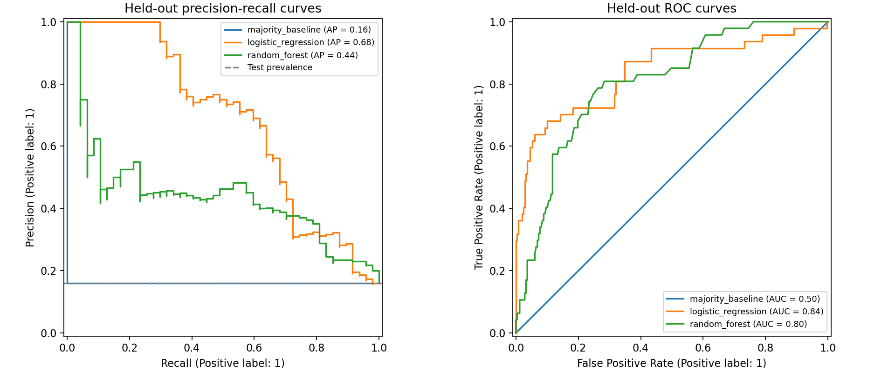

# Employee attrition classification report (Stages 6–7)

Stratified 80/20 split, seed 42: training n=1176 (190 leavers), test n=294 (47 leavers). All preprocessing is fitted after splitting. Five-fold training-only cross-validation selects hyperparameters and the model using mean average precision (AP). The threshold remains 0.5; test results never determine parameters or threshold.

## Models and preprocessing

The majority baseline predicts no attrition for everyone. Logistic regression provides a simpler model; random forest captures nonlinear patterns and interactions. Default and balanced class weights are compared; balanced weights do not guarantee higher recall.
Employee ID, three constant fields, age, gender, marital status and the original target are excluded. Categorical and rating fields are one-hot encoded to avoid assuming equal spacing of ratings. Remaining numeric inputs are standardized for logistic regression only. Each fold fits its own preprocessing through a Pipeline; unknown categories map to all-zero indicators. No SMOTE, outlier removal or test-set tuning.

## Training-only selection

- logistic_regression: CV AP=0.6825, fold SD=0.0421; {'model__C': 0.1, 'model__class_weight': None}
- random_forest: CV AP=0.5537, fold SD=0.0797; {'model__class_weight': None, 'model__max_depth': None, 'model__min_samples_leaf': 1}

Frozen before test evaluation: **logistic_regression**. Fold SD describes five-fold variability, not a 95% confidence interval. The best search CV score can be optimistic.

## Held-out test evaluation

|Model|Accuracy|Precision|Recall|F1|AP|ROC-AUC|TN|FP|FN|TP|
|---|---:|---:|---:|---:|---:|---:|---:|---:|---:|---:|
|majority_baseline|0.840|0.000|0.000|0.000|0.160|0.500|247|0|47|0|
|logistic_regression|0.881|0.773|0.362|0.493|0.678|0.838|242|5|30|17|
|random_forest|0.847|0.625|0.106|0.182|0.438|0.804|244|3|42|5|

The selected model identified 17 leavers, missed 30, and falsely flagged 5 non-leavers.
Precision measures correctness among positive predictions; recall measures coverage of actual leavers; F1 balances them. AP summarizes positive-class ranking across thresholds, not accuracy or trapezoidal PR area. ROC-AUC measures positive-versus-negative ranking. TN/FP/FN/TP denote true negatives, false positives, false negatives and true positives. Baseline precision is set to zero because there are no positive predictions.
Scores are not calibrated probabilities of future attrition. The default 0.5 threshold is not an optimized business decision rule.

## Interpretation and limitations

Logistic coefficients are saved separately. Numeric coefficients use standardized units. Full one-hot encoding with regularization does not provide causal contrasts against one omitted reference category; correlated inputs also affect coefficients.
These are fictional snapshots with unknown measurement and attrition timing, so temporal leakage cannot be ruled out. Full-sample distributions were previously explored: this is an internal educational evaluation, not untouched external validation. A single small test set is unstable. Excluding demographic inputs does not establish fairness.
Both final test results are shown transparently, but model choice was frozen using training CV. Do not tune repeatedly against this test set. No retention gains, cost savings or deployment readiness are claimed. Load only trusted model files you generated.

## Business follow-up

Use the analysis to guide aggregate investigations of workload, onboarding and career development. Real deployment would require new time-stamped data, external evaluation, calibration, fairness assessment and explicit business costs before changing thresholds.

References: [scikit-learn leakage guidance](https://scikit-learn.org/stable/common_pitfalls.html).
